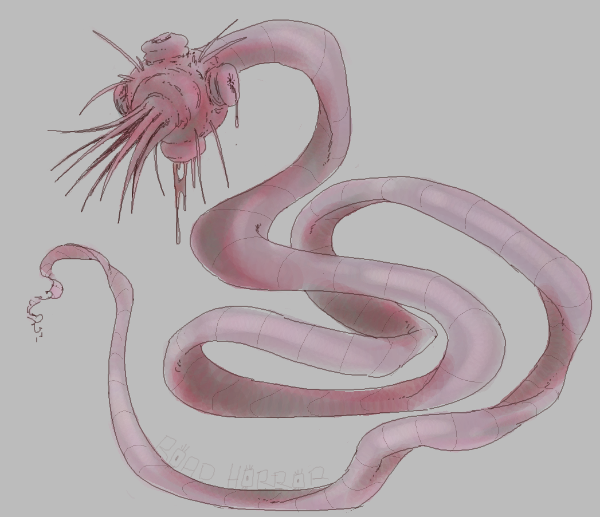

<!-- BEGIN{HTML} -->
<div align="center">
  
  <br>
  <p>Art by <a href='https://twitter.com/Road_Horror'>@Road_Horror</a></p>
</div>
<!--END{HTML}-->

# Parasite

## About

This is the core API for Parasite, a modern torrent indexer with some federation
capacities.

## Documentation

All the documentation for Parasite can be found in the `doc` directory. This
includes the API routes, and a manual for newcomers.

## Installation

```sh
# A PostgreSQL database should be running in the background

git clone --depth=1 https://github.com/bit-bandit/parasite

cd parasite

# Edit the `database` options in `settings.ts` to match what your database has.

deno task start &
```

## Related Projects/Tools

- [`caterpillar`](https://github.com/bit-bandit/caterpillar) - Primary front-end
  for the API.

- [`wormsctl`](https://github.com/bit-bandit/wormsctl) - CLI tool for managing
  Parasite instances

## License

The source code and documention of Parasite is wholly licensed under the 0BSD
license - Basically, do whatever you want with this. Read `LICENSE` for more
information, if you're curious.

### Some exceptions

- The default user avatar (`/static/default/avatar.png`) was taken from a
  library originating from the [9front](http://9front.org/) operating system,
  which is licensed under the MIT license. The original license for that can be
  found [here.](https://github.com/rdbyk/9front/blob/master/lib/legal/mit)
